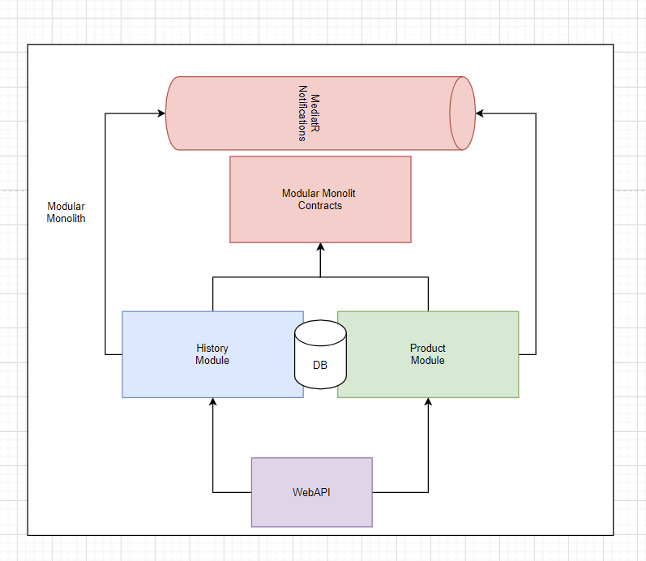
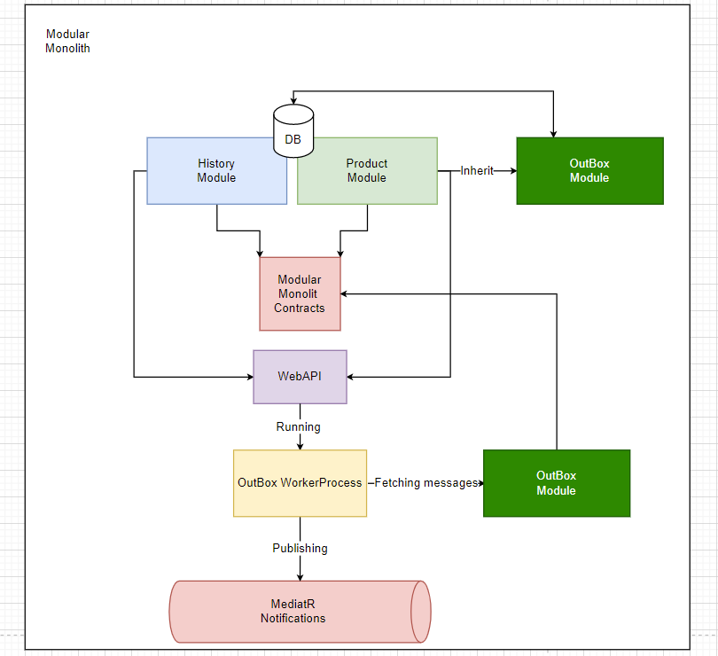

# ModularMonolith

The step by step approach to modular-monolith architecture style.
# Part1 MVP:

# Part2 OutBox:

# Articles:
https://ridikk12.medium.com/easy-modular-monolith-part-1-mvp-d57f47935e24
